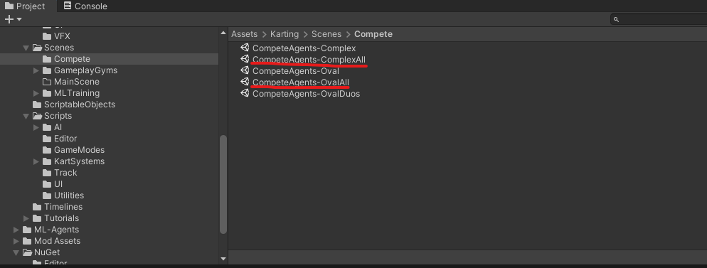
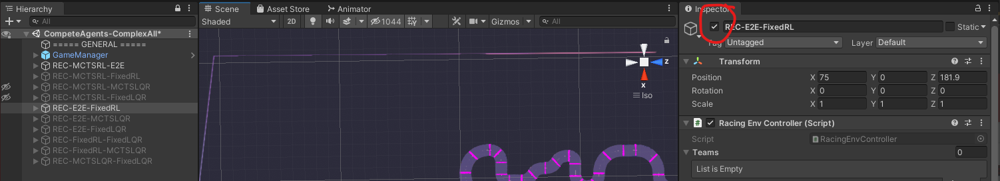
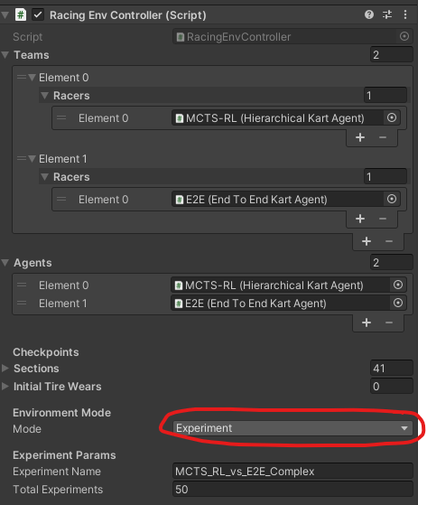
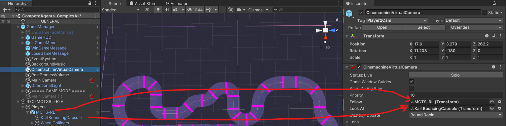
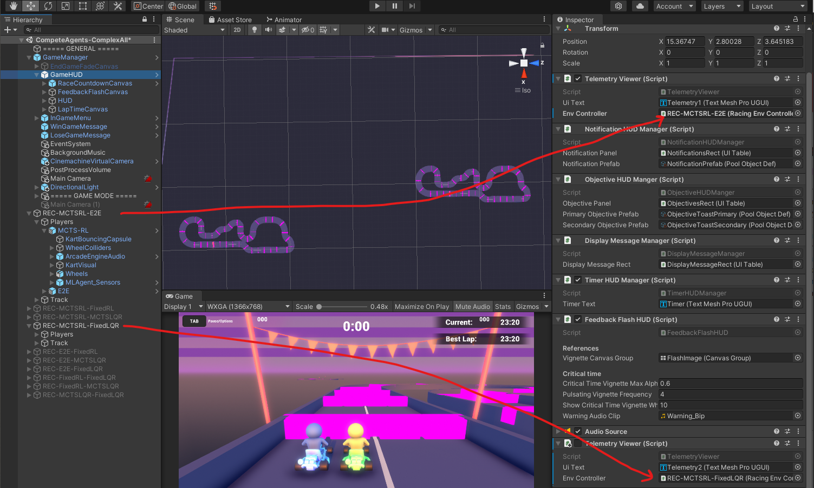

# Head-to-head racing
Code for the paper 'Towards Optimal Head-to-head Autonomous Racing with
Curriculum Reinforcement Learning'
## Code Structure

### Complete Controller Implementation and Simulations in Unity 
Our controller implementations all reside in the
`Assets/Karting/Scripts/AI/` folder. Below are the main scripts
- `HierarchicalKartAgent.cs`: Contains implementation of the Fixed-RL,
  the MCTS-RL, Fixed-LQR, and MCTS-LQR agents depending on the
  selected high-level and low-level modes in the inspector panel for
  agents using this script.
- `EndToEndKartKartAgent`: Contains implementation of the E2E agent.
- `KartAgent.cs`: Base implementation of a Karting Agent that extends
  from the Agent class in the Unity ML agents platform.
- `KartMCTS.cs`: Contains an implementation of Monte Carlo tree search
  algorithm that is used to solve the discrete, high-level game. 
- `LQR/`: Contains classes used to construct and solve a Linear
  Quadratic Nash Game for one of the low-level controllers of the
  Hierarchical Agent.
- `MPC/`: Contains unused/defunct implementations of an MPC based
  low-level controller.

## Simulating the Agents

1. Once the project is loaded into Unity Editor, open the
   `Assets/Karting/Scenes/Compete/CompeteAgents-ComplexAll` or the
   `Assets/Karting/Scenes/Compete/CompeteAgents-OvalAll` scene to find
   pre-loaded racing environments for every pair of agents.

2. Disable/Enable the desired racing environments that include desired
   pair of agents to be tested. Note all of the MARL agents already
   refer to proper the pre-trained policies.

3. Select the environment mode in inspector panel. 
    

   1.  If the environment is set to Training mode, then the agents will
       be spawned in random locations and the hierarchical control will
       be disabled.
    
   2.  If the environment is set to Experiment Mode, the game will run a
       number of simulations and record the results in the file name
       provided in the inspector panel on the right.
    
   3.  If the environment is set to Race mode, the game will run
       simulations until play mode has ended.
     
4. Set the Cinemachine Virtual Camera GameObject Script's Follow and Look At parameters the desired Agent's game
   object and Kart.

5. Select which enabled environment's race details should appear on the
   screen by finding the TelemetryViewer Script settings in the GameHUD
   game object's inspector panel. 2 can be set at a time, but if only one environment is in use, then disable the second telemetry viewer.

6. Press play in the Unity Editor to start simulations.

## Safety-gym results

The safety-gym environment code is under safety-gym directory. Please refer to the instructions there. 
